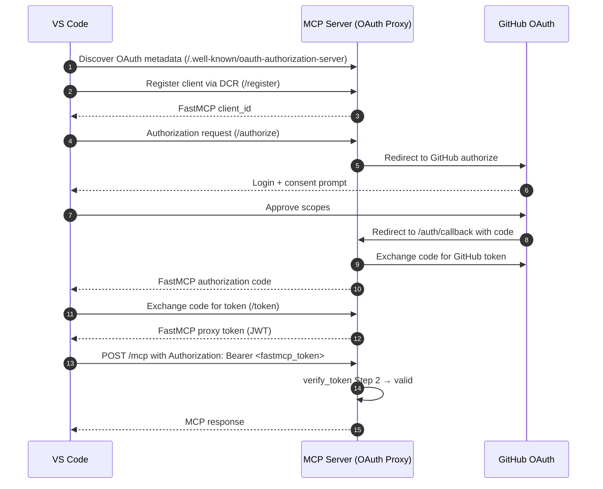
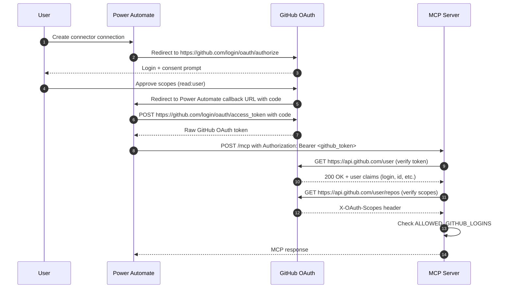

# OAuth Callback Workflows

This document describes the three authentication paths supported by the MCP server and how each client integrates.

---

## Token Verification Chain

Every incoming request passes through `TokenOrGitHubOAuthProvider.verify_token` in order:

```
Step 1 — Static bearer token (MCP_API_TOKEN)
         ↓ fail
Step 2 — FastMCP proxy token (issued by server's /authorize → /token flow)
         ↓ fail
Step 3 — Raw GitHub OAuth token (obtained directly from GitHub)
         ↓ fail
         → 401 Unauthorized
```

`ALLOWED_GITHUB_LOGINS` is enforced on Steps 2 and 3 (OAuth paths).

---

## Client → Workflow Mapping

| Client | Auth method | Token type | Workflow |
|---|---|---|---|
| Lobehub / automation | Static `MCP_API_TOKEN` | Static bearer | Step 1 |
| VS Code Copilot | GitHub OAuth via server proxy | FastMCP proxy token | Step 2 |
| Power Automate / Copilot Studio | GitHub OAuth direct (custom connector) | Raw GitHub token | Step 3 |

---

## Workflow 1: Static Token (Lobehub, automation)

```
Client → POST /mcp with Authorization: Bearer <MCP_API_TOKEN>
MCP Server → hmac.compare_digest → match → 200 OK
```

No GitHub interaction. Fastest path.

---

## Workflow 2: Native MCP Server OAuth (VS Code)

The MCP server acts as an OAuth proxy. VS Code registers via CIMD/DCR and obtains a FastMCP-issued token.



### Callback URL used

```
https://your-domain/auth/callback
```

---

## Workflow 3: Power Automate Direct GitHub OAuth (Copilot Studio)

Power Automate owns the OAuth flow. It obtains a raw GitHub token directly from GitHub and sends it to the MCP server. The server validates it via GitHub's API (Step 3 fallback).



### Callback URL used

```
https://global.consent.azure-apim.net/redirect/<connector-id>
```

Generated by Power Automate — get it from the connector Security tab after first save. Must be registered in your GitHub App's callback URLs.

### Swagger security definition

```yaml
securityDefinitions:
  oauth2-auth:
    type: oauth2
    flow: accessCode
    authorizationUrl: https://github.com/login/oauth/authorize
    tokenUrl: https://github.com/login/oauth/access_token
    scopes:
      read:user: read:user
```

---

## Using Both Workflows Simultaneously

A single GitHub App handles all OAuth clients. No separate apps needed.

Register all callback URLs in the same GitHub App:

```
https://your-domain/auth/callback                              ← VS Code (Workflow 2)
https://global.consent.azure-apim.net/redirect/<connector-id> ← Power Automate (Workflow 3)
```

GitHub Apps support up to 10 callback URLs.

Server env vars needed for both OAuth workflows:

```env
MCP_AUTH_MODE=both
GITHUB_CLIENT_ID=your_github_app_client_id
GITHUB_CLIENT_SECRET=your_github_app_client_secret
BASE_URL=https://your-domain
ALLOWED_GITHUB_LOGINS=your-github-username
```
