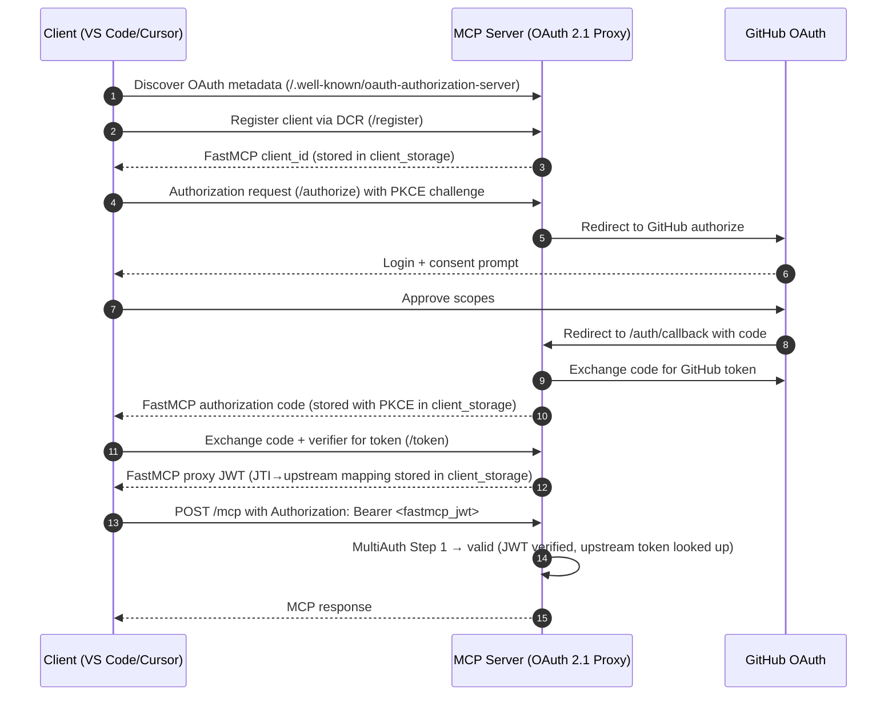
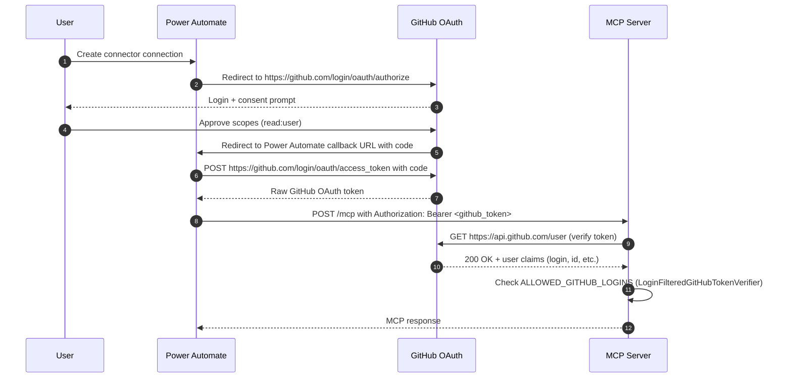

# OAuth Callback Workflows

This document describes the three authentication paths supported by the MCP server and how each client integrates.

---

## Authentication Chain (FastMCP 3.3.1 MultiAuth)

Every incoming request passes through `MultiAuth` in order:

```
Step 1 — OAuth 2.1 proxy (GitHubProvider: DCR + PKCE + CIMD)
         ↓ fail
Step 2 — Static bearer token (DebugTokenVerifier: hmac.compare_digest)
         ↓ fail
Step 3 — Raw GitHub OAuth token (GitHubTokenVerifier: validate via GitHub API)
         ↓ fail
         → 401 Unauthorized
```

`ALLOWED_GITHUB_LOGINS` is enforced on Steps 1 and 3 (OAuth paths) via `LoginFilteredGitHubProvider` and `LoginFilteredGitHubTokenVerifier` wrappers.

---

## Client to Workflow Mapping

| Client | Auth method | Token type | Workflow |
|---|---|---|---|
| Lobehub / automation | Static `MCP_API_TOKEN` | Static bearer | Step 2 |
| VS Code Copilot / Cursor | GitHub OAuth 2.1 via server proxy | FastMCP proxy JWT | Step 1 |
| Power Automate / Copilot Studio | GitHub OAuth 2.0 direct (custom connector) | Raw GitHub token | Step 3 |

---

## Workflow 1: Static Token (Lobehub, automation)

```
Client → POST /mcp with Authorization: Bearer <MCP_API_TOKEN>
MCP Server → hmac.compare_digest → match → 200 OK
```

No GitHub interaction. No server-side state. Fastest path. Survives restarts.

---

## Workflow 2: OAuth 2.1 Proxy (VS Code, Cursor)

The MCP server acts as an OAuth 2.1 proxy. The client registers via DCR, performs PKCE, and obtains a FastMCP-issued JWT. All state is stored server-side via the configured `client_storage` backend.


```mermaid
sequenceDiagram
    autonumber
    participant C as Client (VS Code/Cursor)
    participant MCP as MCP Server (OAuth 2.1 Proxy)
    participant GH as GitHub OAuth

    C->>MCP: Discover OAuth metadata (/.well-known/oauth-authorization-server)
    C->>MCP: Register client via DCR (/register)
    MCP-->>C: FastMCP client_id (stored in client_storage)
    C->>MCP: Authorization request (/authorize) with PKCE challenge
    MCP->>GH: Redirect to GitHub authorize
    GH-->>C: Login + consent prompt
    C->>GH: Approve scopes
    GH->>MCP: Redirect to /auth/callback with code
    MCP->>GH: Exchange code for GitHub token
    MCP-->>C: FastMCP authorization code (stored with PKCE in client_storage)
    C->>MCP: Exchange code + verifier for token (/token)
    MCP-->>C: FastMCP proxy JWT (JTI→upstream mapping stored in client_storage)
    C->>MCP: POST /mcp with Authorization: Bearer <fastmcp_jwt>
    MCP->>MCP: MultiAuth Step 1 → valid (JWT verified, upstream token looked up)
    MCP-->>C: MCP response
```

### Callback URL used

```
https://your-domain/auth/callback
```

### Server state stored

| Collection | Content |
|---|---|
| `mcp-oauth-proxy-clients` | DCR client registrations |
| `mcp-authorization-codes` | PKCE challenges + upstream tokens |
| `mcp-jti-mappings` | FastMCP JWT → upstream GitHub token |
| `mcp-refresh-tokens` | Refresh token metadata (hashed) |
| `mcp-oauth-transactions` | Active authorization flows |

### Persistence

- **Without `FASTMCP_HOME`**: in-memory storage (safe for read-only filesystems). All sessions lost on restart — clients must re-authenticate.
- **With `FASTMCP_HOME`**: persistent encrypted file storage (Fernet). Survives restarts. Recommended for production.

---

## Workflow 3: Power Automate Direct GitHub OAuth (Copilot Studio)

Power Automate owns the OAuth 2.0 flow. It obtains a raw GitHub token directly from GitHub and sends it to the MCP server. The server validates it via GitHub's API (Step 3 fallback). No server-side state is needed — every request is independently verified.


```mermaid
sequenceDiagram
    autonumber
    participant U as User
    participant PA as Power Automate
    participant GH as GitHub OAuth
    participant MCP as MCP Server

    U->>PA: Create connector connection
    PA->>GH: Redirect to https://github.com/login/oauth/authorize
    GH-->>U: Login + consent prompt
    U->>GH: Approve scopes (read:user)
    GH->>PA: Redirect to Power Automate callback URL with code
    PA->>GH: POST https://github.com/login/oauth/access_token with code
    GH-->>PA: Raw GitHub OAuth token
    PA->>MCP: POST /mcp with Authorization: Bearer <github_token>
    MCP->>GH: GET https://api.github.com/user (verify token)
    GH-->>MCP: 200 OK + user claims (login, id, etc.)
    MCP->>MCP: Check ALLOWED_GITHUB_LOGINS (LoginFilteredGitHubTokenVerifier)
    MCP-->>PA: MCP response
```

### Callback URL used

```
https://global.consent.azure-apim.net/redirect/<connector-id>
```

Generated by Power Automate — get it from the connector Security tab after first save. Must be registered in your GitHub App's callback URLs.

### Swagger security definition

```yaml
securityDefinitions:
  oauth2-auth:
    type: oauth2
    flow: accessCode
    authorizationUrl: https://github.com/login/oauth/authorize
    tokenUrl: https://github.com/login/oauth/access_token
    scopes:
      read:user: read:user
```

---

## Using All Workflows Simultaneously

A single GitHub App handles all OAuth clients. No separate apps needed.

Register all callback URLs in the same GitHub App:

```
https://your-domain/auth/callback                              ← VS Code/Cursor (Workflow 2)
https://global.consent.azure-apim.net/redirect/<connector-id> ← Power Automate (Workflow 3)
```

GitHub Apps support up to 10 callback URLs.

Server env vars needed for all workflows:

```env
MCP_AUTH_MODE=both
MCP_API_TOKEN=your-static-token
GITHUB_CLIENT_ID=your_github_app_client_id
GITHUB_CLIENT_SECRET=your_github_app_client_secret
BASE_URL=https://your-domain
ALLOWED_GITHUB_LOGINS=your-github-username
# Optional: persistent OAuth storage
# FASTMCP_HOME=/var/lib/mcp-auth-sample/fastmcp
```
